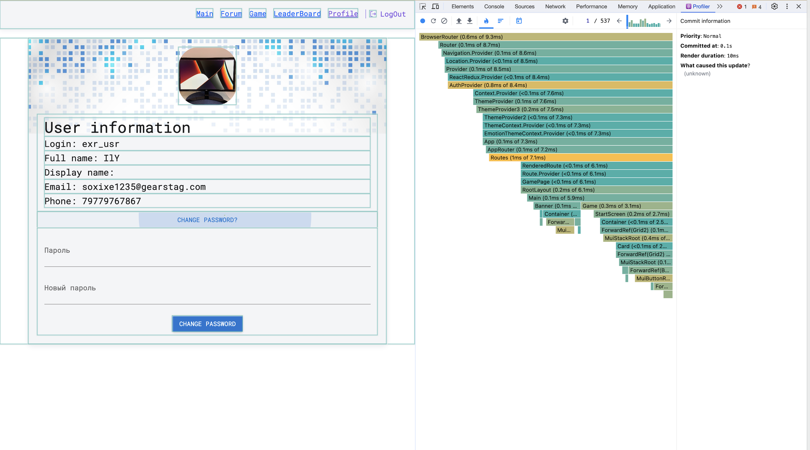
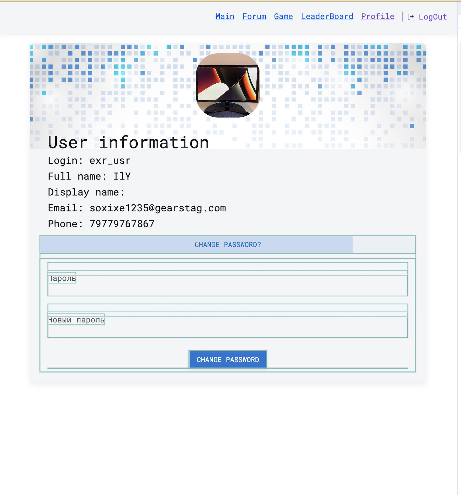

## Поиск утечек памяти
___

## Введение
Целью данного отчета является детальное описание процесса поиска утечек памяти в проекте с использованием различных инструментов. Анализ проводился с использованием Devtools, React DevTools и инструментов для статического анализа кода.

### Devtools

Данный инструмент предоставляет возможность мониторинга использования памяти во времени. Использование этого инструмента позволяет выявить динамику изменений и определить возможные проблемы с утечками.

С помощью данного метода обнаружить утечки памяти не удалось, после работы сборщика мусора память возвращалась к первоначальному значению

Отчет содержит следущие события:
- Первичная загрузка и привязка событий;
- Реакция на события;
- Очистка счетчика, удаление ссылки и привязка нового;

Проведен мониторинг использования памяти во время работы приложения. Не было выявлено критических изменений или утечек, что свидетельствует о стабильной работе приложения с точки зрения использования памяти.

### React DevTools

React DevTools предоставляет информацию о состоянии компонентов React и их жизненном цикле. Этот инструмент может быть полезен для выявления проблем, связанных с утечками памяти в компонентах React.

Данный метод показывает нам возможные лишние ре-рендеры компонентов и причину перерисовки

На скриншотах видно, что при нажатии на кнопку "Change Password?" происходила перерисовка всех компонентов, которые не относятся к форме смены пароля  

После мемоизации компонента формы и привязки ссылки на коллбэк, который управляет отрисовкой компонента теперь рендерится только форма

До:

После:

Анализировались состояния компонентов React в различных частях приложения. Не было обнаружено аномалий, указывающих на потенциальные утечки памяти внутри компонентов.

### Статический анализ кода

Данный метод позволяет предотвратить ошибки на стадии написания и компиляции исходного кода.

#### Циклические зависимости
Использование статического анализа кода, такого как ESLint с правилом `import/no-cycle`, направлено на предотвращение циклических зависимостей, которые могут привести к утечкам памяти. Это предоставляет дополнительный слой защиты от потенциальных проблем в будущем.

## Заключение
На данный момент утечек памяти в проекте не выявлено. Применение инструментов Devtools, React DevTools и статического анализа кода позволило обеспечить стабильность использования памяти приложением. Введенное правило `import/no-cycle` предоставляет дополнительную гарантию от циклических зависимостей, которые могут привести к утечкам в будущем.

## Рекомендации
### Продолжайте мониторинг:

Рекомендуется регулярно проводить мониторинг использования памяти приложения, особенно при внесении изменений или добавлении нового функционала.

### Поддерживайте актуальность инструментов:

Следите за обновлениями инструментов разработки, таких как Devtools и React DevTools, чтобы использовать последние возможности анализа и мониторинга памяти.

### Обучение команды:

Рекомендуется провести обучение членов команды по использованию инструментов мониторинга и анализа для эффективного обнаружения и предотвращения утечек памяти.
Этот отчет представляет текущую картину состояния утечек памяти в проекте на момент его проведения. Будут предприняты дополнительные меры при обнаружении изменений в использовании памяти или при появлении новых факторов, которые могут повлиять на утечки.