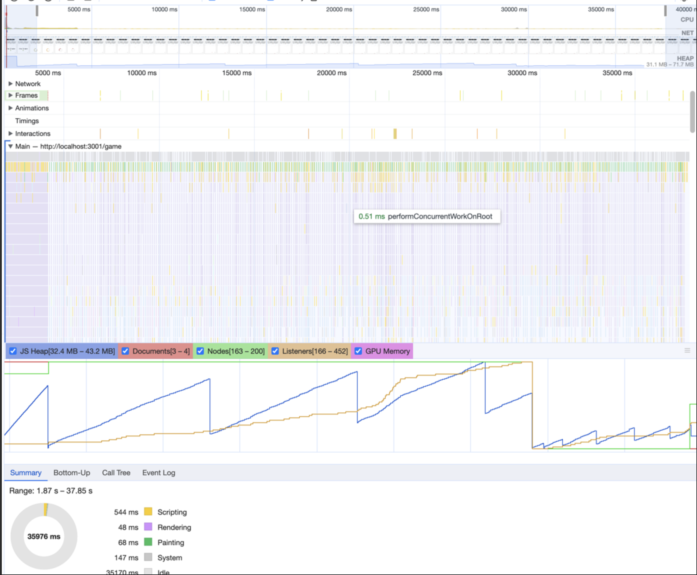

## Поиск утечек памяти
___

Для поиска утечек по памяти использовались следующие инструменты:
- Devtools -> Performance -> Memory;
- React DevTools;
- Инструменты для статического анализа кода;

### Devtools

С помощью данного метода обнаружить утечки памяти не удалось, после работы сборщика мусора память возвращалась к первоначальному значению

Отчет содержит следущие события:
- Первичная загрузка и привязка событий;
- Реакция на события;
- Очистка счетчика, удаление ссылки и привязка нового;

### React DevTools

